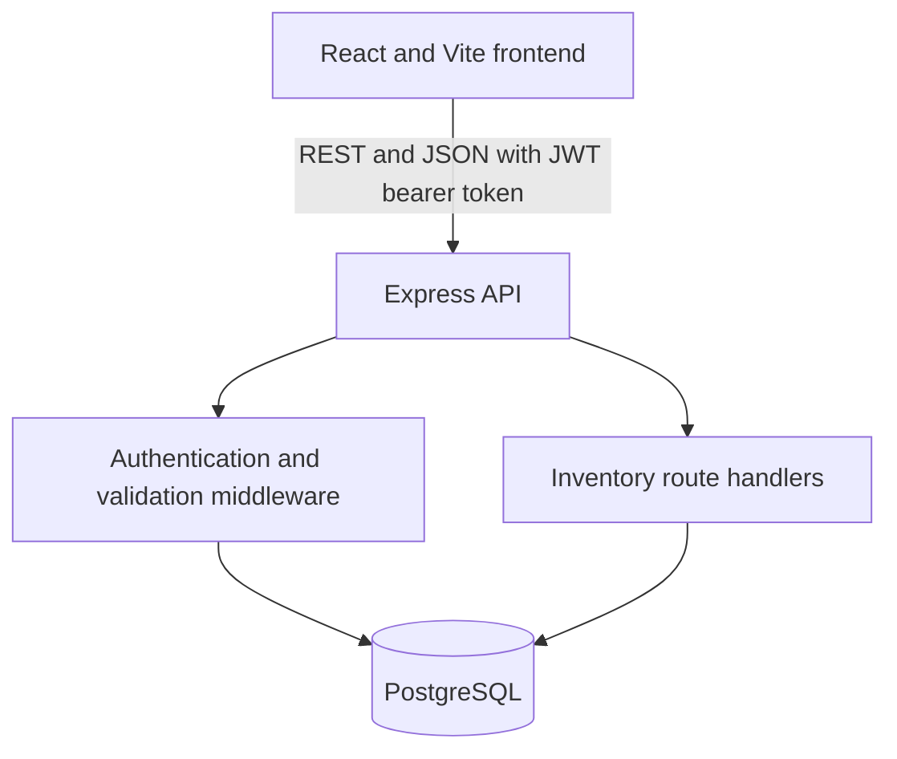

# StockSense — Inventory Management System

StockSense is a demo-ready inventory management system (IMS) for tracking products, categories, warehouses, storage locations, stock operations, and inventory movement history. It provides a centralized alternative to manual registers and disconnected spreadsheets, with stock tracked by product and location.

## 1. Project overview

Inventory tracked across spreadsheets and paper records can become fragmented, slow to reconcile, and difficult to audit. StockSense brings catalog management and warehouse workflows together in a React application backed by an Express REST API and PostgreSQL.

## 2. Problem statement

Teams need a reliable view of what is in stock, where it is stored, what is awaiting processing, and how quantities changed. Manual updates and separate records make it harder to spot low stock, prevent overselling, and explain discrepancies.

## 3. Objectives

- Centralize product, category, warehouse, and location records.
- Track quantities by product and storage location.
- Validate stock movements before applying them.
- Reject deliveries and transfers that exceed available stock.
- Record validated quantity changes in a searchable stock ledger.
- Provide a responsive interface for day-to-day warehouse work.

## 4. Target users

- Inventory managers
- Warehouse staff

## 5. Key features

### Authentication

- Account registration, login, and logout.
- Passwords stored as bcrypt hashes.
- Signed JWT bearer tokens for authenticated API access.
- OTP-based password reset. In development, the reset code is returned by the API; production email/SMS delivery is not implemented.

### Dashboard

- Products in stock, low-stock products, and out-of-stock products.
- Pending receipts, pending deliveries, and scheduled transfers.
- Filters for operation type, status, warehouse, location, and category.
- Recent ledger activity and refresh action.

### Product and category management

- Create and update products with a name, SKU, category, unit, and reorder level.
- Search products and filter by category.
- Create, edit, and delete categories; deletion is rejected while products are assigned to a category.
- Products start with no recorded stock. Use a receipt to add inventory rather than entering an initial quantity on the product form.

### Warehouse and location management

- Create warehouses and related storage locations.
- Edit location name, code, and warehouse.
- Delete unused locations; deletion is rejected when inventory or operation/ledger history references the location.
- Database foreign keys restrict deletion rather than cascading through stock or history.
- Warehouse editing and deletion are not currently available.

### Receipts

- Record inbound items and quantities at a destination location, with supplier/reference details.
- A receipt affects stock only after successful validation.
- Validation increases the destination location's stock and records a ledger entry.

### Delivery orders

- Record products and quantities leaving a source location, with optional customer/reference details.
- Validation rejects insufficient stock, decreases stock, and records a ledger entry.
- Open operations can be canceled without changing stock.

### Internal transfers

- Move quantities from a source location to a different destination location.
- Validation decreases stock at the source and increases it at the destination.
- A transfer preserves total stock across the two locations and records both location changes.

### Inventory adjustments

- Enter a physical count for products at a destination location.
- Validation reconciles recorded stock to the count and records the difference in the ledger.

### Stock ledger and reordering

- Review operation, product, location, source/destination, quantity change, before/after quantities, timestamp, and user for validated movements.
- View low-stock and out-of-stock status based on each product's reorder level.

## 6. Inventory workflow

1. **Receive:** validate a receipt of 100 units to add 100 units at the destination.
2. **Transfer:** move 20 units from Receiving to Main Storage; total stock remains unchanged.
3. **Deliver:** validate a delivery of 10 units to subtract 10 units from its source location.
4. **Adjust:** enter the physical count and validate to reconcile system quantity to the count.
5. **Review:** each validated stock-changing operation is represented in the stock ledger.

Operations are created as drafts. Stock changes occur during validation; canceling an open operation does not change stock.

## 7. System architecture



- **Frontend:** renders the inventory interface, submits requests, and presents loading, validation, success, and error feedback.
- **Backend:** Express routes handle authentication, request validation, inventory rules, and API responses. Route handlers use the PostgreSQL client directly; there is no separate controller/service directory.
- **Database:** PostgreSQL stores users, catalog data, stock, operations, and ledger history with relational constraints.
- **Authentication:** bcrypt protects stored passwords; JWT bearer tokens protect inventory routes, and logout records revoked token IDs.

## 8. Database design

The schema is defined in `database/migrations/001_init.sql`.

| Entity | Purpose and relationships |
| --- | --- |
| `users` | Accounts that create and validate operations. |
| `categories` | Product groupings; a product's category may be unset. |
| `products` | Product identity, unique SKU, unit, active state, and reorder level. |
| `warehouses` | Warehouse identity and address. |
| `locations` | Storage locations belonging to a warehouse; name and code are unique within that warehouse. |
| `stock` | Current quantity per product and location, keyed by `(product_id, location_id)`. |
| `operations` | Receipt, delivery, transfer, or adjustment document with status and location references. |
| `operation_items` | Products and quantities belonging to an operation. |
| `stock_ledger` | Per-location movement history, including quantity before, change, and after. |
| `password_reset_tokens` / `revoked_tokens` | Reset-code state and revoked JWT identifiers. |

Primary and foreign keys connect the records. Unique indexes protect email and SKU comparisons; check constraints validate fields, operation shape, and non-negative quantities. Location references in stock, operations, and ledger history use `ON DELETE RESTRICT`. Product-category deletion is handled by the API and rejected while products still use the category.

PostgreSQL provides relational integrity and transactional updates. Stock rows are locked during operation validation, and each stock update and its ledger entry are written in the same database transaction. Neon is used as a hosted PostgreSQL provider for development/demo; the application uses the standard PostgreSQL driver and can also connect to a compatible PostgreSQL instance.

## 9. API overview

All API routes are under `/api`. Except for health and the listed public authentication endpoints, routes require a JWT bearer token. See [server/API.md](./server/API.md) for request/response details.

| Area | Implemented routes |
| --- | --- |
| Health | `GET /health`, `GET /api/health` |
| Authentication | `POST /auth/register`, `POST /auth/login`, `GET /auth/me`, `PATCH /auth/profile`, `POST /auth/logout`, `POST /auth/reset/request`, `POST /auth/reset/confirm` |
| Products | `GET/POST /products`, `GET/PATCH/PUT/DELETE /products/:id` |
| Categories | `GET/POST /categories`, `PATCH/DELETE /categories/:id` |
| Warehouses | `GET/POST /warehouses` |
| Locations | `GET/POST /locations`, `PATCH/DELETE /locations/:id` |
| Stock and dashboard | `GET /stock`, `GET /dashboard`, `GET /dashboard/summary`, `GET /dashboard/operations` |
| Operations | `GET/POST /operations/:kind`, `GET /operations/:kind/:id`, `POST /operations/:kind/:id/validate`, `PATCH /operations/:kind/:id/status`, `POST /operations/:kind/:id/cancel` |
| Ledger | `GET /ledger`, `GET /ledger/:productId` |

`:kind` is `receipts`, `deliveries`, `transfers`, or `adjustments`. The API also mounts operation collection routes at `/:kind`. Category routes additionally have `/products/categories` aliases. Password reset also accepts `POST /auth/forgot-password`, `/auth/verify-otp`, `/auth/reset/verify`, and `/auth/reset-password`.

## 10. Validation and error handling

- Zod schemas validate request bodies, including required names, email/password shape, UUIDs, operation items, and quantity bounds.
- Database constraints enforce uniqueness, foreign keys, and quantity rules.
- Delivery and transfer validation reject insufficient source stock. Transfers require different source and destination locations.
- Category deletion is rejected if products are assigned. Location deletion is restricted when inventory or operation/ledger records reference it.
- Invalid or missing authentication is rejected; the API returns structured JSON errors.
- Common responses include `400` for invalid requests, `401` for authentication failures, `404` for unknown resources, `409` for conflicts such as duplicate values or protected deletion, and `503` when the database/schema is unavailable.
- The frontend shows request errors and save/delete progress, and uses success toasts after successful changes.

## 11. Security

- Passwords are hashed with bcrypt.
- Signed JWTs protect inventory routes; logout records revoked token IDs, and tokens expire.
- PostgreSQL queries use parameterized values. Query filtering and limits are validated before use.
- Request bodies are validated server-side; PostgreSQL constraints provide additional integrity checks.
- Configuration is read from environment variables. Keep `.env` local and do not commit it.
- Local reset OTPs are returned only outside production. A production OTP delivery provider is not included.

## 12. UI/UX

StockSense uses a modern, professional skeuomorphic warehouse-control design: raised panels, recessed inputs, tactile buttons, subtle bevels and shadows, and clear stock/status indicators. The layout adapts to smaller screens and uses labeled controls, visible focus styles, and loading, error, empty, and success feedback.

## 13. Testing and verification

The repository does not currently define an automated test suite or test script. Functional scenarios have been manually exercised:

- **Authentication:** registration/login, logout, protected API access, invalid credentials, and development OTP password reset.
- **Products:** create/update, SKU search, category filtering, and reorder-level/status display.
- **Categories:** create, edit, delete when unused, and reject deletion when products are assigned.
- **Locations:** create and edit; delete an unused location; reject deletion of a location referenced by stock/history.
- **Inventory:** receipt increases stock, delivery decreases stock, transfer moves stock while preserving total quantity, adjustment reconciles counted quantity, insufficient stock is rejected, and ledger changes are recorded.
- **Dashboard:** KPI values and filters, including pending delivery counts.

Release checks:

```bash
npm run build --prefix client
node --check server/src/app.js
node --check server/src/auth.js
node --check server/src/db.js
node --check server/src/index.js
node --check server/src/inventory.js
node --check server/src/validation.js
node --check database/migrate.js
node --check database/seed.js
```

The production frontend build, backend syntax checks, PostgreSQL migration, API startup/health check, and location/category API checks have been run during repository preparation. The migration and seed commands were also verified together against a disposable PostgreSQL 16 database; no hosted demo records were changed during that check. Explicit PostgreSQL TLS with certificate verification was tested against the configured database.

## 14. Local development

### Requirements

- Node.js (20 or newer recommended) and npm.
- PostgreSQL, either local or hosted (for example, Neon).

### Setup

1. Clone the repository and enter its root:

   ```bash
   git clone https://github.com/Scubek06/StockSense-OdooXhackathon.git
   cd StockSense-OdooXhackathon
   ```

2. Install backend and frontend dependencies using the manifests in the repository:

   ```bash
   npm install
   npm install --prefix client
   ```

3. Create a local environment file and configure it:

   ```bash
   cp .env.example .env
   ```

   Set `DATABASE_URL` to the PostgreSQL connection string and `JWT_SECRET` to a unique random secret at least 24 characters long (for example, generate one with `openssl rand -base64 32`). Set `CLIENT_URL` to the browser origin serving the frontend, normally `http://localhost:5173`. The API uses `CLIENT_URL` as its CORS allow-list; configure the actual client origin(s) for the environment. Never commit `.env`.

4. Create the database named in `DATABASE_URL` if needed, then apply the schema and seed development data:

   ```bash
   npm run migrate
   npm run seed
   ```

   The seed script creates or updates demo records. Use it only with a development/demo database, not a production database.

5. Start the backend and frontend in separate terminals from the repository root:

   ```bash
   npm run dev
   npm run dev --prefix client
   ```

   The API defaults to port `3000`; Vite serves the client on port `5173` and proxies `/api` requests to the API. Check `http://localhost:3000/api/health` for database connectivity. Forward both ports when using Codespaces.

   To start the API without file watching, use the existing start script:

   ```bash
   npm start
   ```

6. Create a production frontend build when needed:

   ```bash
   npm run build --prefix client
   ```

### Environment variables

| Variable | Purpose |
| --- | --- |
| `PORT` | API port; defaults to `3000`. |
| `NODE_ENV` | Runtime mode; reset codes are not returned in production. |
| `CLIENT_URL` | Comma-separated allowed frontend origins for CORS. |
| `DATABASE_URL` | PostgreSQL connection string. |
| `PG_POOL_MAX` | Maximum PostgreSQL pool size; defaults to `10`. |
| `PGSSL` | Set to `true` to explicitly enable TLS with certificate verification. |
| `JWT_SECRET` | JWT signing secret; required and at least 24 characters. |
| `JWT_EXPIRES_IN` | JWT lifetime; defaults to `12h`. |
| `OTP_EXPIRY_MINUTES` | Reset-code lifetime in minutes, clamped by the backend to 1–60. |
| `DEMO_EMAIL` | Seed account email; defaults to `demo@stocksense.local`. |
| `DEMO_PASSWORD` | Optional known password for the seed account; otherwise generated by the seed script. |

## 15. Demo account

The seed script defaults to the email `demo@stocksense.local`. Set `DEMO_EMAIL` to override it and `DEMO_PASSWORD` to choose a known password before running the seed. If `DEMO_PASSWORD` is unset, the script generates a random password; in non-production mode it prints the generated login details. No demo password is committed in this repository.

## 16. Project structure

```text
.
├── client/
│   ├── index.html
│   ├── package.json
│   ├── package-lock.json
│   ├── vite.config.js
│   └── src/
│       ├── App.jsx
│       ├── main.jsx
│       ├── services/api.js
│       └── styles.css
├── database/
│   ├── migrate.js
│   ├── seed.js
│   └── migrations/
│       └── 001_init.sql
├── server/
│   ├── API.md
│   └── src/
│       ├── app.js
│       ├── auth.js
│       ├── db.js
│       ├── index.js
│       ├── inventory.js
│       └── validation.js
├── .env.example
├── .gitignore
├── package.json
└── README.md
```

## 17. Hackathon evaluation alignment

- **Database design:** relational entities, foreign keys, uniqueness and check constraints, and a movement ledger.
- **Architecture and maintainability:** separate frontend, API, validation, authentication, database, migration, and seed modules; inventory route handlers remain in `server/src/inventory.js`.
- **Coding standards and validation:** ES modules, parameterized database values, request schemas, and consistent JSON error handling.
- **Security:** bcrypt password hashes, protected API routes, JWT expiry/revocation, environment-based configuration, and ignored local secrets.
- **Scalability and performance:** indexed query paths, bounded list limits, and a configurable PostgreSQL connection pool; this is a demo system and has not been load-tested.
- **Usability:** operational KPIs, contextual filters, clear statuses, and feedback on actions.
- **Responsive frontend:** React/Vite layout and mobile navigation styles.
- **Real-world applicability:** location-aware receipts, deliveries, transfers, adjustments, and movement history.
- **Git/version control:** repository changes are tracked in Git; do not commit local environment files or generated dependencies.

## 18. Future enhancements

These are possibilities, not current features:

- Role-based permissions beyond the current account role.
- Richer pick/pack and delivery workflows.
- Production email/SMS password-reset delivery and reset-attempt rate limiting.
- Supplier/customer master data.
- Barcode scanning.
- Audit exports, advanced analytics, and automated notifications.

## 19. Demo screenshots

Screenshots will be added here when available. No screenshots are included in the repository yet.

- Login
- Dashboard
- Products
- Receipt
- Delivery order
- Internal transfer
- Inventory adjustment
- Stock ledger
- Warehouse locations
